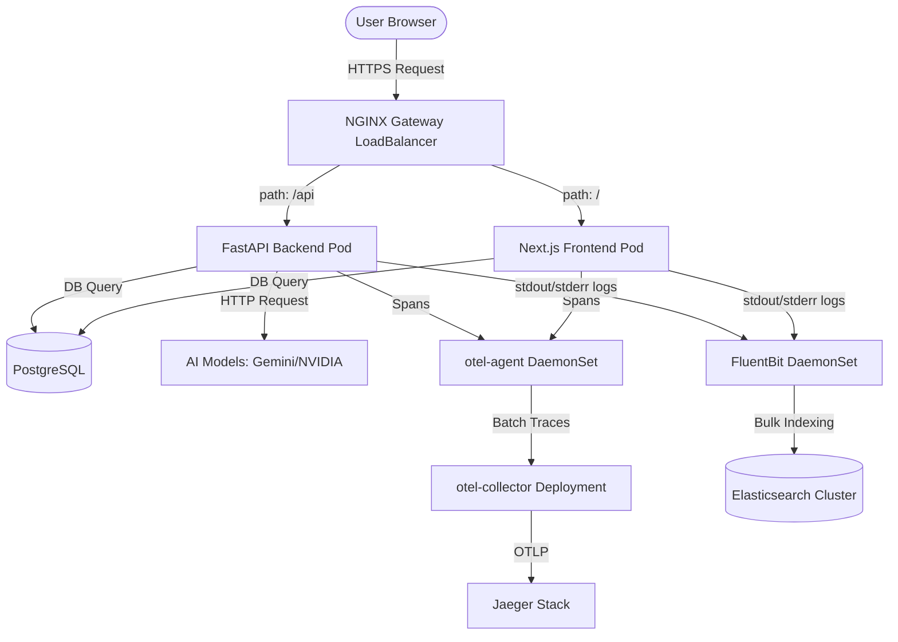

# End-to-End OpenTelemetry Tracing & Ingress Deployment Guide

Use this guide to deploy, run, and understand the gateway ingress traffic flow, OpenTelemetry + Jaeger tracing, and centralized logging architecture using an Elasticsearch backend in the `resumatch-ai` namespace.

---

## 1. System Ingress & Traffic Flow Architecture

The following diagram illustrates how user requests enter the GKE cluster, propagate through services, and how logs and traces are collected:



### Ingress Traffic Route
1.  **Ingress Entry**: The client resolves `resumatches.com` or `jaiswal.shop` pointing to the public external IP of the NGINX Gateway Controller.
2.  **Gateway Routing**: The `resumatch-gateway` Gateway resource handles TLS termination using `resumatch-tls-secret`.
3.  **HTTPRoute Decisions**:
    *   Requests with prefix `/api` match `backend-route` and route to the backend service (`backend-service:8090`).
    *   All other request paths `/` match `frontend-route` and route to the frontend service (`frontend-service:3000`).
    *   Requests targeting the `jaeger` hostname match `jaeger-route` and route to the Jaeger UI service (`jaeger-service:16686`).

---

## 2. Deployment Checklist

### Phase 1: Deploy Collector, DaemonSet Agents & Jaeger

- [ ] **1. Deploy Jaeger Stack**
  Apply the Jaeger deployment and service manifest:
  ```bash
  kubectl apply -f kubernetes/jaeger.yaml
  ```
  *Verification:* Ensure the Jaeger pod is in `Running` state:
  ```bash
  kubectl get pods -n resumatch-ai -l app=jaeger
  ```

- [ ] **2. Deploy OpenTelemetry Collector & DaemonSet Agents**
  Apply the OTel Collector service, OTel Collector deployment, OTel Agent DaemonSet, and their ConfigMaps:
  ```bash
  kubectl apply -f kubernetes/otel-collector.yaml
  ```
  *Verification:* Verify that the agent daemonset is running on your nodes and the collector is healthy:
  ```bash
  kubectl get daemonset otel-agent -n resumatch-ai
  kubectl get deployment otel-collector -n resumatch-ai
  kubectl get pods -n resumatch-ai -l app=opentelemetry
  ```

- [ ] **3. Configure Host-Node OpenTelemetry Endpoints**
  Apply the updated ConfigMap containing the node-level agent target path `http://$(NODE_IP):4318/v1/traces`:
  ```bash
  kubectl apply -f kubernetes/configmap.yaml
  ```

- [ ] **4. Setup Gateway Routing for Jaeger UI**
  Apply updates to the gateway routing and redirection rules:
  ```bash
  kubectl apply -f kubernetes/gateway.yaml
  kubectl apply -f kubernetes/routes.yaml
  ```
  *Verification:* Verify that the `jaeger-route` HTTPRoute is successfully admitted by the Gateway controller:
  ```bash
  kubectl describe httproute jaeger-route -n resumatch-ai
  ```

---

### Phase 2: Deploy Backend & Frontend Workloads

- [ ] **5. Build & Push Updated Images**
  Rebuild and push Docker images for both backend and frontend. The configuration updates in `requirements.txt` and `package.json` will be automatically compiled.

- [ ] **6. Apply Updated Workload Manifests**
  Deploy updated backend and frontend manifests containing both `NODE_IP` injection and the OTLP endpoint environment configuration:
  ```bash
  kubectl apply -f kubernetes/backend.yaml
  kubectl apply -f kubernetes/frontend.yaml
  ```

- [ ] **7. Perform Workload Restart**
  Force containers to fetch the new environment variables and initialize tracing:
  ```bash
  kubectl rollout restart deployment/backend -n resumatch-ai
  kubectl rollout restart deployment/frontend -n resumatch-ai
  ```
  *Verification:* Wait for rollouts to finish successfully:
  ```bash
  kubectl rollout status deployment/backend -n resumatch-ai
  kubectl rollout status deployment/frontend -n resumatch-ai
  ```

---

### Phase 3: Verify End-to-End Tracing Flow

- [ ] **8. Access Jaeger Query UI**
  If DNS for `jaeger.resumatches.com` is configured, navigate to it directly. Otherwise, map a local port forward:
  ```bash
  kubectl port-forward svc/jaeger-service 16686:16686 -n resumatch-ai
  ```
  Then open [http://localhost:16686](http://localhost:16686) in your browser.

- [ ] **9. Generate Test Traffic**
  Perform user actions in the frontend app (e.g., upload a resume, sign in, or run matching checks).

- [ ] **10. Check Flow Traces**
  In the Jaeger UI search panel:
  * Select `frontend` or `backend` from the **Service** dropdown.
  * Click **Find Traces**.
  * Confirm that trace spans display the full flow through:
    - **Frontend:** Server Actions and API page loads.
    - **Backend API:** Fast API routes (`resumatch-api`).
    - **Database Queries:** Postgres queries mapped to backend SQLAlchemy queries and frontend Postgres clients.
    - **AI Engine Calls:** Outgoing calls via `httpx`/`requests` to Gemini/NVIDIA API models.

---

## 3. Centralized Logging with Elasticsearch (ELK / EFK Stack)

To run a fully production-ready monitoring suite, logs should be centralized alongside traces.

### How it Works
1.  **Collection**: A log shipper (like **FluentBit** or **Filebeat**) runs as a DaemonSet on every node. It mounts the node's `/var/log/containers/*` directory where container standard output (stdout/stderr) is stored.
2.  **Processing**: The log shipper parses the raw JSON container logs, enriches them with Kubernetes metadata (namespace, pod name, container name, host node), and extracts the `trace_id` and `span_id`.
3.  **Shipper Routing**: The logs are pushed to an **Elasticsearch** (or OpenSearch) endpoint using bulk indexes (e.g., `resumatch-logs-YYYY.MM.DD`).
4.  **Visualization**: Developers query the centralized log index using **Kibana** or **Grafana**.

### FluentBit Configuration Example
Create a FluentBit configuration configmap pointing to your Elasticsearch cluster:

```yaml
apiVersion: v1
kind: ConfigMap
metadata:
  name: fluent-bit-config
  namespace: resumatch-ai
data:
  fluent-bit.conf: |
    [SERVICE]
        Flush         1
        Log_Level     info
        Parsers_File  parsers.conf

    [INPUT]
        Name              tail
        Tag               kube.*
        Path              /var/log/containers/*.log
        Parser            docker
        DB                /var/log/flb_kube.db
        Mem_Buf_Limit     5MB
        Skip_Long_Lines   On

    [FILTER]
        Name                kubernetes
        Match               kube.*
        Kube_URL            https://kubernetes.default.svc:443
        Kube_CA_File        /var/run/secrets/kubernetes.io/serviceaccount/ca.crt
        Kube_Token_File     /var/run/secrets/kubernetes.io/serviceaccount/token
        Kube_Tag_Prefix     kube.var.log.containers.
        Merge_Log           On
        Keep_Log            Off

    [OUTPUT]
        Name            es
        Match           *
        Host            elasticsearch-logging.resumatch-ai.svc.cluster.local
        Port            9200
        Logstash_Format On
        Logstash_Prefix resumatch-app-logs
        Type            _doc
        HTTP_User       elastic
        HTTP_Passwd     ${ES_PASSWORD}
        tls             On
        tls.verify      Off
```

### Core Logging Use Cases
*   **Trace-Log Correlation (Search by ID)**: When a request fails, locate the `trace_id` in the Jaeger UI. Since log lines are formatted with trace context, search for `trace_id: "YOUR_JAEGER_TRACE_ID"` in Kibana to view the console logs for the exact lifecycle of that single HTTP request.
*   **Structured Search & Filters**: Search by namespace, pod label (`app=backend`), or log level (`level=ERROR`).
*   **Anomaly Detection**: Build dashboard graphs tracking the frequency of exceptions (like database timeout errors or NVIDIA model rate-limits).

---

## 4. Future Improvements & Best Practices

To optimize telemetry in a high-scale production environment, consider the following recommendations:

### 1. Context Propagation
To tie client-side browser events directly to backend traces:
*   Configure **W3C Trace Context headers** (specifically `traceparent`) in the frontend HTTP requests when calling the backend API.
*   Next.js does this automatically for API fetches made inside Node.js Server components, but for client-side API requests, ensure headers are passed to preserve trace continuity.

### 2. Head-based or Tail-based Sampling
Sending 100% of traces is expensive and redundant:
*   **Head-based sampling**: Configure OTel Agent or SDKs to capture a ratio (e.g., 5-10% of successful traces) to save network and storage costs.
*   **Tail-based sampling**: Configure the OTel Collector to analyze traces *before* exporting (e.g., drop 100% of fast health check requests `/health`, but keep 100% of traces containing HTTP status >= 500 or running slow database/AI model calls).

### 3. Trace-Log Correlation
Bind logs and traces together:
*   Use the OpenTelemetry python logging handler in `logging.basicConfig` to inject `trace_id` and `span_id` automatically into backend logs.
*   This lets you look at a slow request in Jaeger, copy its `trace_id`, and search for all corresponding stdout/stderr logs in your cluster's log analyzer (like Google Cloud Logging or Grafana Loki).

### 4. Metrics & Alerting Exporters
Expand the collector capabilities:
*   Configure the Prometheus exporter on the OTel Collector to scratch resource metrics from your pods and route them directly to Prometheus.
*   Set up alerts (e.g. via Alertmanager) on high latency spikes or error count thresholds on key spans (like AI text generation and vector searches).
